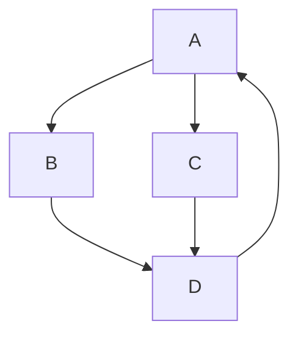

# Introduction to Programming - Variable Lab
by Nima jamalian

Table of Contents
[Variable](#variable)
[Testing Math in markdown](#testing-math-in-markdown)
[Code](#code)
[Marking Grapgh](#marking-grapgh)
[Marking Grapgh 1](#marking-grapgh-1)
[Marking Grapgh 2](#marking-grapgh-2)
## Variable
1. The first questions would go here?
	<details>
	<summary>Solution</summary>
	
	This is the answer to that question.
	```javascript
	function findCharIndices(data, target){
	    let result = [];
	    for(let i=0; i<data.length; i++){
	        if(data[i] === target){
	            result.push(i);
	        }
	    }
	    return result;
	}
	
	input = "banana";
	console.log(findCharIndices(input,"b"));//output: [ 0 ]
	console.log(findCharIndices(input,"a"));//output: [ 1, 3, 5 ]
	console.log(findCharIndices(input,"n"));//output: [ 2, 4 ]
	console.log(findCharIndices(input,"z"));//output: []
	```

	</details>

1. The first questions would go here?
	<details>
	<summary>Solution</summary>
	
	This is the answer to that question.
	```javascript
	function findCharIndices(data, target){
	    let result = []
	    for(let i=0; i<data.length; i++){
	        if(data[i] === target){
	            result.push(i);
	        }
	    }
	    return result;
	}
	
	input = "banana";
	console.log(findCharIndices(input,"b"));//output: [ 0 ]
	console.log(findCharIndices(input,"a"));//output: [ 1, 3, 5 ]
	console.log(findCharIndices(input,"n"));//output: [ 2, 4 ]
	console.log(findCharIndices(input,"z"));//output: []
	```

	</details>
1. The first questions would go here?
	<details>
	<summary>Solution</summary>
	
	This is the answer to that question.
	```javascript
	function findCharIndices(data, target){
	    let result = []
	    for(let i=0; i<data.length; i++){
	        if(data[i] === target){
	            result.push(i);
	        }
	    }
	    return result;
	}
	
	input = "banana";
	console.log(findCharIndices(input,"b"));//output: [ 0 ]
	console.log(findCharIndices(input,"a"));//output: [ 1, 3, 5 ]
	console.log(findCharIndices(input,"n"));//output: [ 2, 4 ]
	console.log(findCharIndices(input,"z"));//output: []
	```

	</details>
## Testing Math in markdown
          *
         / \
        +   c
       / \
      a   b

### Testing Algorithms notation in markdown
Time $O(\theta)$
Space $O(n)$
Worst Case $O(1)$

### Code
```javascript
function findCharIndices(data, target){
    let result = []
    for(let i=0; i<data.length; i++){
        if(data[i] === target){
            result.push(i);
        }
    }
    return result;
}

input = "banana";
console.log(findCharIndices(input,"b"));//output: [ 0 ]
console.log(findCharIndices(input,"a"));//output: [ 1, 3, 5 ]
console.log(findCharIndices(input,"n"));//output: [ 2, 4 ]
console.log(findCharIndices(input,"z"));//output: []
```

### Marking Grapgh


### Marking Grapgh 1


### Marking Grapgh 2

